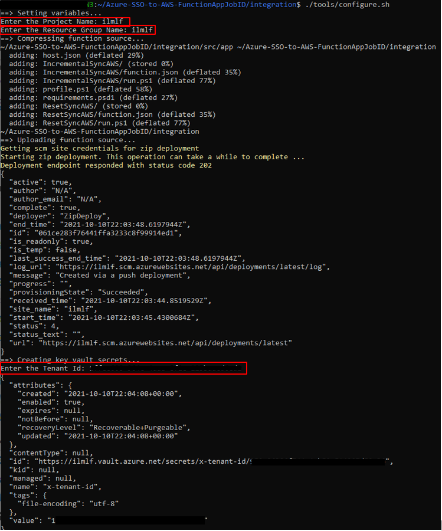
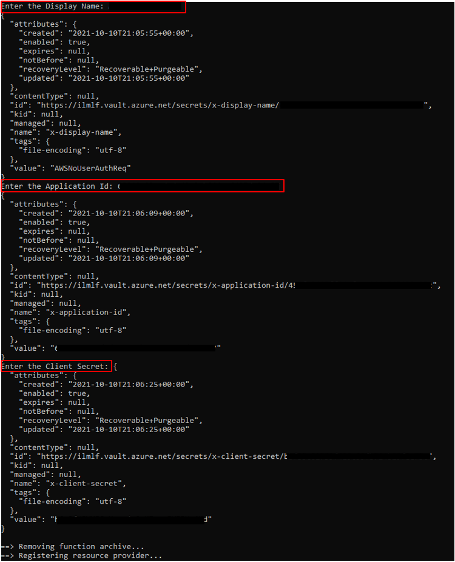
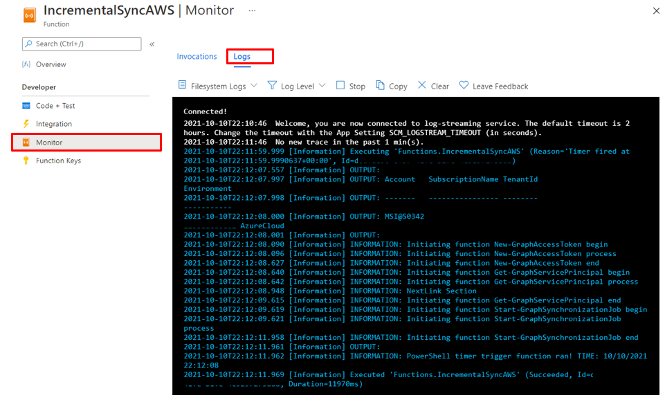
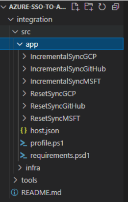

## Overview
- Automatic SCIM provisioning of Azure AD to AWS SSO with PowerShell using an Azure Function with KeyVault integration using a Timer (cron job) Function
- This solution uses Windows WSL or a Mac due to the running of shell scripts to prompt for values

## Prerequisites
- Configure **AWS Single Sign-On** with the steps outlined in this [article](https://aws.amazon.com/blogs/aws/the-next-evolution-in-aws-single-sign-on/)
- Configure **On-Demand SCIM provisioning of Azure AD to AWS SSO with PowerShell** with the steps outlined in this [article](https://aws.amazon.com/blogs/security/on-demand-scim-provisioning-of-azure-ad-to-aws-sso-with-powershell/)

## Dependencies

- Azure Cli - install from this [link](https://docs.microsoft.com/en-us/cli/azure/install-azure-cli)
- For Windows 10 with WSL then run the following to ensure zip is installed:

  ```
  apt-get install zip
  ```

- The current timer is scheduled to run every 3 minutes - "schedule": "0 */3 * * * *" 
  - To update this value - change the function.json file from 3 to another number (e.g. 2, 3, 4, 20 to have it run every 2,3, 4 or 20 minutes)
    - Configure the Cron job with examples from this [article](https://github.com/atifaziz/NCrontab)
- The first time the function is invoked - it will automatically pull down it's Az dependencies listed in the `requirements.psd1` file in this project.
    - Please Allow 10 to 15 minutes for this process to complete - you will see initial errors while this is being setup

## Configure Function to trigger SCIM by Job ID
There are two functions contained in this repo -
1. Incremental Function - will run on a cron timer every 3 minutes unless (user defined) triggering the Azure API to sync Users and Groups
2. Initial Function - will perform a reset/sync on all Users and Groups at midnight UTC. This is used to remove the 'Watermark' assigned to synced users so all of them will be sent again.
    - The Job Restart Sync is based on the Watermark [article](https://docs.microsoft.com/en-us/graph/api/resources/synchronization-synchronizationjobrestartcriteria?view=graph-rest-beta)


## Import the Azure Template
- Import the main.json file and deploy from Azure.  
  - Login to the Azure Portal -  search for Template Specs in the top Search Bar
  - Import the "main.json" template from the identityjourney-azuresso\integration\src\infra subdirectory of the cloned repo
## Deploy the Template for the base Infrastructure
- Select the template that was just created from Template Specs
- Select Deploy from the Top Menu 
- The template asks for two parameters - I  recommend naming the Resource Group and the Project the same and both in lower for ease of deployment
- Create a new Resource Group e.g. awsssoscim
  - User - this is the Object ID of the person deploying and is retrieved by logging into the Azure Portal
  -  Select Azure AD
     - Users
         - Select the Object ID associated with your User ID and this is a one time use only which allows the script to store the values in Azure Key Vault
  - Project - **Lowercase Only** this is the name of the function - this must be in lowercase only as it creates a Storage Account for the function as part of the process
      

  


## Provide the Input Values to the Azure Functions
- Before running the following - login to Azure with the Az Cli using the following command **az login**
- Once the base infrastructure has been deployed run the following which will upload the zip, deploying the functions and the user will be prompted for the values which are stored in Keyvault
- Run the configure.sh script  (If you receive an error - ensure you run chmod +x configure.h)
  - ./tools/configure.sh

  - The script will prompt the users for the following values to be filled in :
      - PROJECT :
      - RESOURCE_GROUP :
      - x-tenant-id : 
      - x-display-name : 
      - x-app-id : 
      - x-client-secret : 




## Check the status of the function
  - To verify the function is working properly - go to the Azure Portal
    - Go to the Resource Group that was deployed
    - Click on the Function App 
    - In the Menu, Select Functions
    - Select the Function you are looking to monitor
    - In the left menu - select Monitor and then on the top menu select Logs
    - This will display the output of the function running
    - If there are any errors, please allow 10-20 minutes for the function to pull down it's initial dependency for the Az module




## Add additional Functions for SCIM Endpoints 
The App comes with one function, however, to create additional functions to trigger different SCIM endpoints, just copy and paste the function and rename it.

1. To add extra SCIM endpoint functions, copy the folder and rename to the new endpoint
2. Open `profile.ps1` and update the new Environment Variable with the SCIM Job ID
3. Open the run.ps1 inside the folder that was copied and **update line (179)** - `$jobId = $env:JobIdIncrementalSync` with the new environment variable
4. Repeat step 2 if you also have copied the reset folder.  **Update line 184** - `$jobId = $env:JobIdResetSyncMSFT` with the new environment variable



When adding additional functions, you will need to update the main.json template to a [maximum of 10](https://docs.microsoft.com/en-us/azure/azure-functions/functions-app-settings#functions_worker_process_count_). Both of these values to 4.


