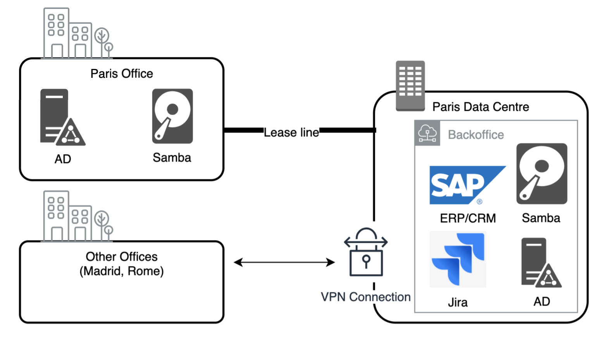

# Working From Home

When a company has majority of its employees switch to working from home, the number of VPN connections will suddenly increase. The VPN Concentrator might not be able to handle the load (e.g. due to limit IPSec clients). This solution shows how to scale VPN connection capacity to accommodate VPN connections from the work-from-home employees. 

This README.md contains only architecture and installation steps. For more details, please check the blog series [part 1](https://medium.com/i-love-my-local-farmer-engineering-blog/working-from-home-1-2-748d9acc3fb8), [part 2](https://medium.com/i-love-my-local-farmer-engineering-blog/working-from-home-2-2-53142394620b) 

## Prerequisites
1. **NodeJS (v. 12+)** This repository is written in Java. But NodeJS is required for running and installing AWS CDK. You can download it [here](https://nodejs.org/en/download/).
1. **AWS CDK (v. 1.102.0)**: This solution uses AWS CDK for deployment. If you aren't familiar with CDK, please install its [prerequisites](https://cdkworkshop.com/15-prerequisites.html) and follow the  [Java workshop](https://cdkworkshop.com/50-java.html) first.   
1. **JDK 8 or later**: If you haven't used installed this version before, you can use [Amazon Corretto 8 distribution](https://aws.amazon.com/corretto/)
1. **Maven**: For building the CDK code into assets for deployment. 

## Architecture
To understand what this solution will deploy, we will start from the original architecture.



The on-prem Paris Data Center connects to Paris Office via a lease line, but has VPN connection for other office (as they have lower traffic). The VPN connector cannot scale beyond 50 IPSec clients, so we need to change its architecture to support additional VPN connections from employees.


The solution uses AWS Client VPN to handle connections from employees' laptops. Then it forwards traffic to the Paris Data Center via AWS Site-to-Site VPN. AD Connector handles authentication and authorization.

## Components 

The main components of these solutions are in separate folders:
1. `SiteToSiteConnection` will set up AWS Site-to-Site VPN and an AWS VPC that we'll deploy AWS client VPN.  
1. `ClientConnection` will set up AWS Client VPN alongs with AD Connector.
1. `CustomResourceUtils` contains reusable code for creating a custom resource. This is used by `ClientConnection` for AD setup.

## Installation steps
1. `SiteToSiteConnection` component
    1. Modify `SiteToSiteConnection`'s [cdk.context.json](SiteToSiteConnection/cdk.context.json) with your on-prem IP address, CIDR range, and AWS region/availability zones.
    1. Change the account an region in the file [SiteToSiteConnectionApp.java](SiteToSiteConnection/src/main/java/com/ilmlf/sitetositeconnection/SiteToSiteConnectionApp.java)
    1. Deploy with
    ```
    cd SiteToSiteConnection
    mvn package
    cdk deploy 
    ```
1. Manually create a secret in Secret Manager with name `DomainAdminPassword` and put AD admin password in it. Create a [resource-based policy](https://docs.aws.amazon.com/secretsmanager/latest/userguide/auth-and-access_resource-based-policies.html) to limit the access on who could read the value.
1. Deploy `ClientConnection` component 
    1. Modify the following fields in `ClientConnection`'s [cdk.context.json](ClientConnection/cdk.context.json) 
        * `onPremCidr`: Same as the last stack
        * `domain` and `dns`: Switch to your domain name and DNS IP Address.
        * `clientVpnCidr`
        * `clientVpnCertificate`
        * `DomainAdminSecretArn`
        * `vpc-provider:account...`: Change the AWS account number, VPC ID, region, subnet, and AZs to match the resource deployed from the previous step. These information is from the  `SiteToSiteConnection` stack
    1. Deploy with
    ```
    cd ClientConnection
    mvn package
    cdk deploy 
    ```
